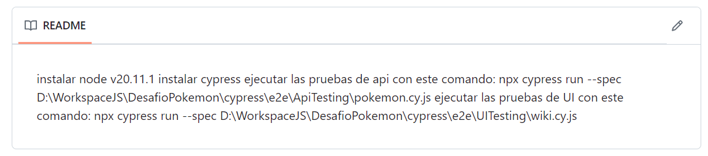
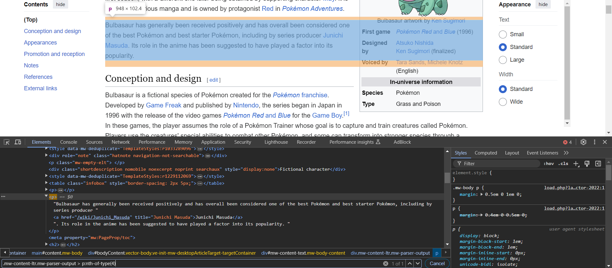

# Observaciones:

## Readme.md

1. No se indica cómo instalar Node ni Cypress, o bien una URL a alguna documentación donde se explique.
2. Se indica un directorio hardcodeado: al clonar el proyecto, el mismo tiene el nombre "Challenge" y no "DesafioPokemon", y la ruta donde uno hace clona el proyecto no necesariamente es `D:\WorkspaceJS`.
3. El Readme.md se ve en una única línea:
   

## Tests

1. Hay archivos que son generados por defecto por Cypress y no son utilizados, pero no fueron eliminados, por ejemplo, `spec.cy`.
2. No se hace uso de la clave secreta: no hay un log previo a la ejecución de cada test que loguee la clave secreta usando sha256.
3. Solamente se está validando el status code, no así los atributos `id`, `name` ni `abilities`.
4. No se valida el tiempo de respuesta de la API.
5. El locator `.mw-content-ltr.mw-parser-output > p:nth-of-type(4)` para imprimir el primer párrafo de "Conception and design" solamente sirve para Pikachu, no así para los demás, por ejemplo, Bulbasaur.

6. Si bien el proyecto es acotado, no se aplicó POM.
7. No se hace uso de las configuraciones de Cypress para especificar baseUrl.

## Otros

1. Se hizo push de `node_modules`, lo cual en general no es una buena práctica.
2. Si bien no se solicitó, no se implementó otras características que pudieron haber sido implementas, como ser linter, pre-push, beautifier, GitHub actions.
